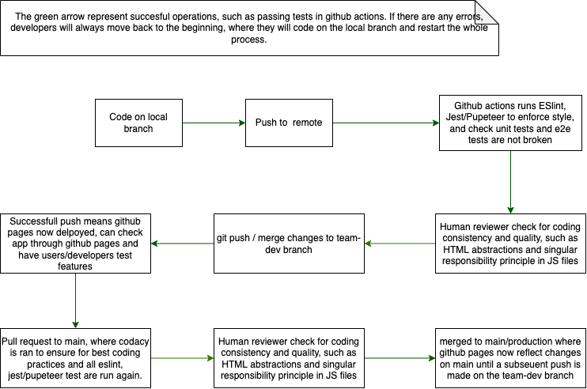

## Current Pipeline
Our current pipeline consists of a linting procedure which is done by eslint named `CI - Linter` on github actions. The procedure is activated by github actions on all branches whenever on both `push` and `pull request`. An example of this can be found on PR #25. More specifically, we specificied eslint with the linter configurations from **both** google and eslint:recommended. A complete set of linting/style checks can be found [here](https://github.com/google/eslint-config-google/blob/master/index.js). There is also a pipeline folder located at the root of the reposity which locates the config file of the linting procedure, which overrides several rules. Some of which are jsdocs to warning and unused variable as warnings instead of errors. This is because we forsee that we will have the functions and the jsdocs written out before the body of the javascript file is written out. Jsdocs are also warning because we don't want people be stuck on writing out documentation for every function they use (when they push), in the case that their version of the code isn't used. Linting rules can be revised further during developement. For developers, adding `--fix` tag while running eslint locally will fix most errors.

An example of it working is  , where we can see that `foo` has various errors, and `hello` fixes all of said errors/warnings.

Additionally, we also have a jest/pupeteer pipeline setup on github actions, named `CI - Unit Tests`. The tests can be run locally through `npm run test` or they can view the result of the test through github actions after every push and pull request, regardless of what branch they are working on. All the tests will be localted in the [test](.__tests__) folder. 

Furthermore, we also have have set up a github action named `Deploy to Github Pages` which is triggered whenever there is a push to main or the team-dev branch. When the action is triggered, there will be an attempt to download the changes to the respective branch and push them on to the gh-pages branch. Since the github pages for this repository is based on the gh-pages branch, this means that our github pages will be updated whenever there is a push to our development branch, team-dev, or our main branch, main. The motivation behind having a gh-page for our team-dev branch is so that we can quickly share our progress to our other team members when we want to test something out. They no longer have to checkout our branch and check it out using live server.

We have also provided a `package.json` and `package-lock.json` at the root of the repository for dependencies. 

Aside from automatic checks, we also have human checks. For every push onto the team-dev branch, we have a reviewer look over that commit which is assigned through github projects and issues. We have also disabled direct pushes onto the main branch, where a pull request is needed and reviewed by a separate person before that is merged. The people responsible for this is also usually also on the linked issue/github project sprintboard. Both of these human checks check for code quality and logic, to see if we following prinsciples of software engineering such as documenting our code, modular code structure, and single responsibility principle. 

On every pull request, Codacy will check the `CSSLint, Jackson Linter, PMD, Stylelint, remart-lint`.

In short, we currently run 3 jobs through github actions, linting, testing, and deployment to gh-pages, which are triggered on every push to any branch, with the exception of deployment which is only triggered when pushing to main or team-dev. This is accompanied by human checks through pull requests to main and pushes to team-dev branch.

A diagram of the current pipeline can also be found below
.

## Future Pipeline
Although we have the github actions set up, we still have yet to implement a thorough suite of unit and end to end tests on within the test directory. We plan on implementing more unit and end to end tests by the end of Saturday of week 10.

One thing that comes to mind that is an issue is the fact that the github pages for this repository can either mean the developmental stage or the main stage, based on which has the latest push. As a result, there may be confusion for the end user. That said, a potential solution would be to have a separate repository for release, where the release version would be based on that repository's github pages.

Moreover, there also plans to be use of jsdocs to automatically generate documentation. Unsure of how this process will work yet but we will be writing documentation while we develop as jsdocs are part of the linting process (though it's a warning not error). 
