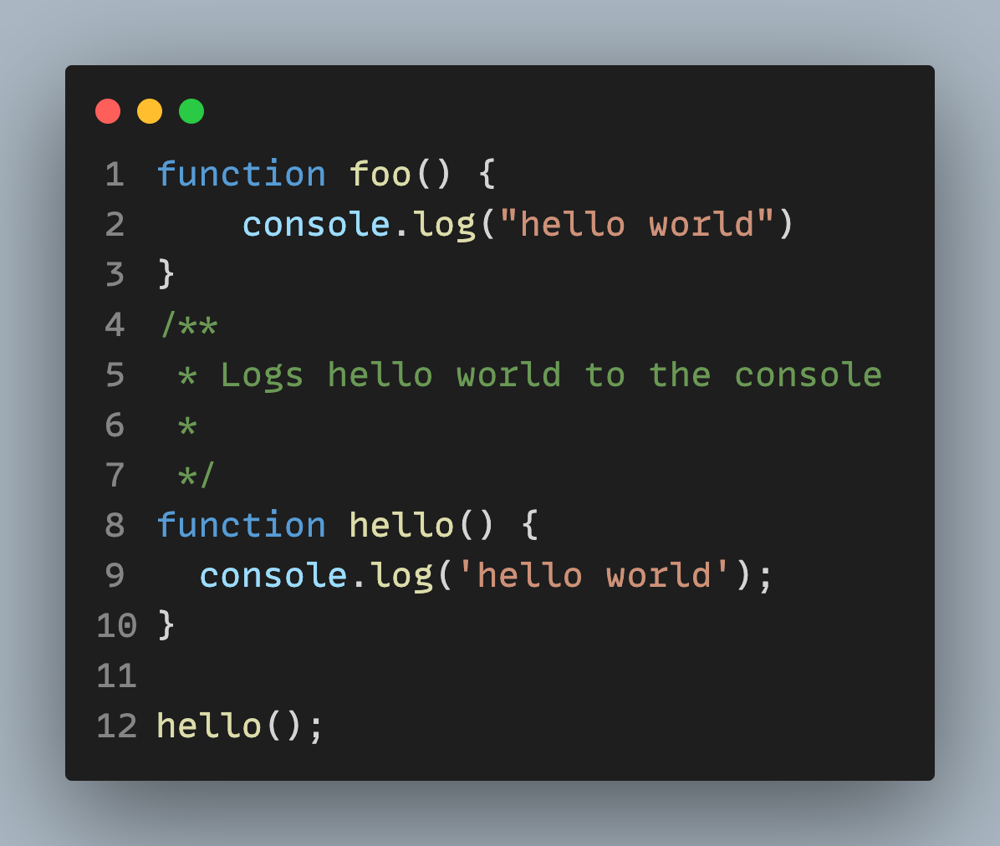
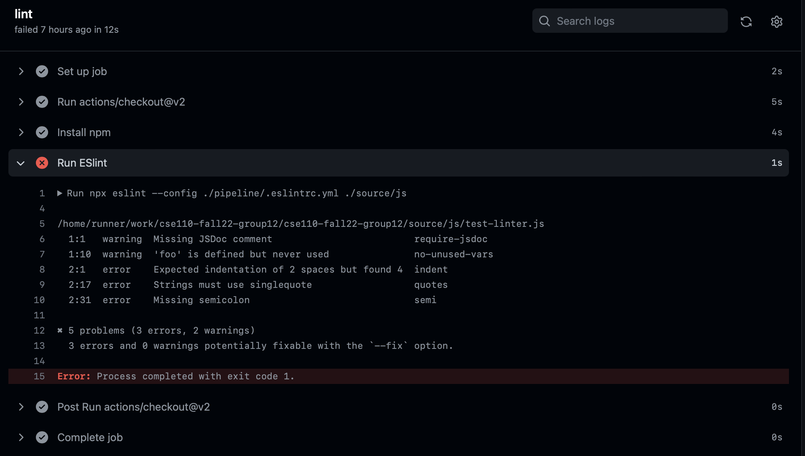

## Current Pipeline

Our current pipeline consists of the linting procedure which is done by eslint. The procedure is activated by github actions on all branches whenever on both `push` and `pull request`. An example of this can be found on PR #25. More specifically, we specificied eslint with the linter configurations from **both** google and eslint:recommended. A complete set of linting/style checks can be found [here](https://github.com/google/eslint-config-google/blob/master/index.js). Do note that a `package.json` is not located/needed in the root folder as google's linting configuraitons are installed within the action of `npm install --save-dev eslint eslint-config-google`. There is also a pipeline folder located at the root of the reposity which locates the config file of the linting procedure, which overrides two rules: jsdocs to warning and unused variable as warnings instead of errors. This is because we forsee that we will have the functions and the jsdocs written out before the body of the javascript file is written out. Jsdocs are also warning because we don't want people be stuck on writing out documentation for every function they use (when they push), in the case that their version of the code isn't used. Linting rules can be revised further when we actually enter developement.

An example of it working is  , where we can see that `foo` has various errors, and `hello` fixes all of said errors/warnings.

A diagram of the current pipeline can also be found [here](./phase1.drawio.png).

## Future Pipeline

We still have to setup a unit test procedures, which will likely come out during week 8. However, this process may not be in Jest or incorporated with github actions yet. It was recommended to us by Professor Powell that we have unit tests locally on our computer through a bash script first.

Moreover, there also plans to be use of jsdocs to automatically generate documentation. Unsure of how this process will work yet but we will be writing documentation while we develop as jsdocs are part of the linting process (though it's a warning not error).

Furthermore, there is a plan to have a discussion on how pull request reviews will be made. Likely, it will involve 3 reviewers per pull request. The current structure of the time consists of: design, coding a, coding b, and pipeline. There is a plan to to have a leader/member from each of the other groups to review the pull request. Who those will be still have yet to be decided.
