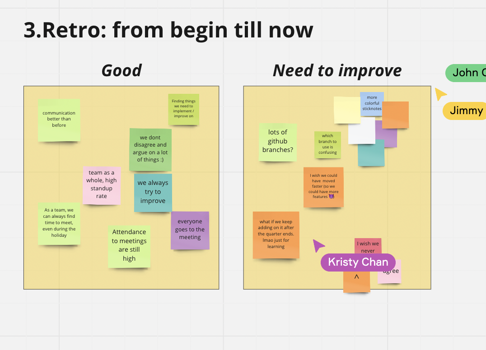

# Sprint 3 Review Meeting Note #
**Date: 11.29.2022**\
**Time: 5:30 pm - 6:30 pm**\
**Meeting Format: Zoom**

The goal of the meeting is to look back from beginning of the project until now and figure out what we have done that is good, and what we need to improve

## Attendance ##
-  [x] Zheyuan Wang
-  [x] Ruoxuan Li
-  [x] John Chou
-  [x] Elliot Lee
-  [x] Deze Lyu
-  [x] Jimmy Cho
-  [x] Lucas Lee
-  [x] Yunyi She 
-  [x] Kristy Chan
-  [x] Sebastian Pamudji

## Good ##
-  Communnication better than before
- Finding things we need to implement/improve on
-  Teams as a whole, high standup rate
-  We don't disagree and argue on a lot of things
-  We always try to improve
-  As a team, we can always find time to meet, even during holiday
-  Attendance to meetings are high 

## Need to Improve ##
-  Lots of github branches
-  The use of each branch could be confusing
-  Could have moved faster so we could have more features

