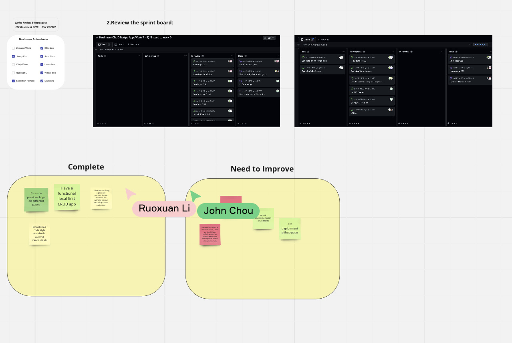

# Sprint 3 Review Meeting Note #
**Date: 11.29.2022**\
**Time: 5:30 pm - 6:30 pm**\
**Meeting Format: Zoom**

The goal of the meeting is to see what has been accomplished, go over work accomplishment and not to criticize or correct the agile process. Process review and improvement is the main purpose of the retrospective activity. 

## Attendance ##
[x] Zheyuan Wang
[x] Ruoxuan Li
[x] John Chou
[x] Elliot Lee
[x] Deze Lyu
[x] Jimmy Cho
[x] Lucas Lee
[x] Yunyi She 
[x] Kristy Chan
[x] Sebastian Pamudji

## Completed Tasks ##
- Reviewed the sprint board - most things just needs to be reviewed
- Went over what we have completed during this sprint
  - Fixed some previous bugs on different pages
  - Established code style standards, and commit standards
  - Did a good job communicating what we are working on and reporting to each other 
  - Have a functional CRUD app
  - Changed the configuration of prettier 
- Went over what we need to improve 
  - Improve "bus factor", not having one person to complete the entire pipline 
  - Actual Implementation of unit tests
  - Fix deployment github page
  - Update Readme.md
  - The alert box has not been standardized 
  - More testing

