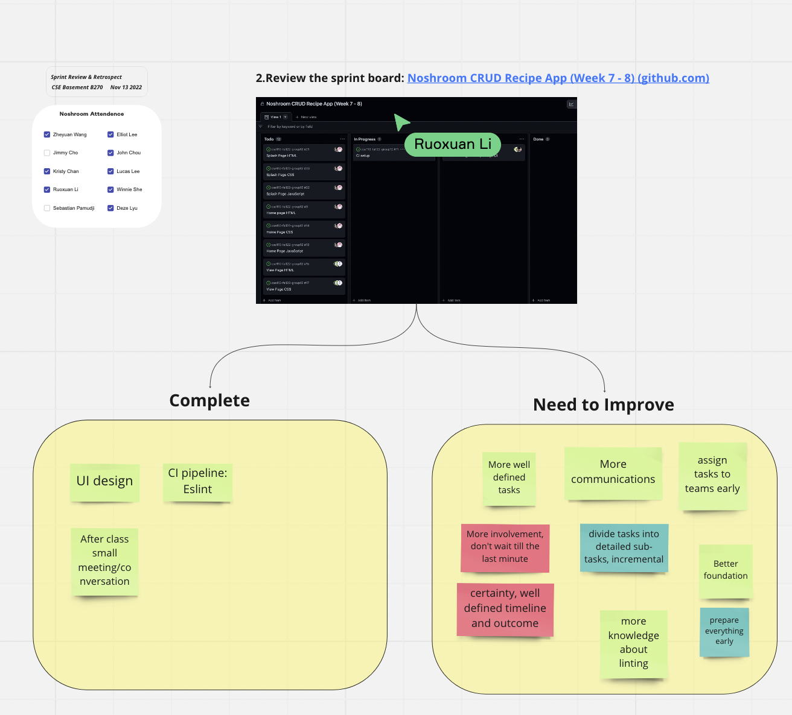

# Sprint 1 Review Meeting Note

**Date: 11.14.2022**\
**Time: 6 pm - 6:30 pm**\
**Meeting Format: Hybrid (Zoom + PC)**

The goal of the meeting is to go over work accomplishment and not to criticize or correct the agile process. Process review and improvement is the main purpose of the retrospective activity.

## Attendance

- [x] Zheyuan Wang
- [x] Ruoxuan Li
- [x] John Chou
- [x] Elliot Lee
- [x] Deze Lyu
- [ ] Jimmy Cho
- [x] Lucas Lee
- [x] Yunyi She
- [x] Kristy Chan
- [ ] Sebastian Pamudji

## Completed Tasks

- Discussed what we have completed in the project (UI design, CI pipline: Eslint, After class small meetings/conversations)
- Review the sprint board (went over what each member is assign to do)

## Uncompleted Sprintboard Tasks

- Start building the navigation portion of the web app
- After that, every member needs to start on their assigned task

## What To Improve On Next Time

- More well defined tasks
- More communications
- Assign tasks to teams early
- More involvement don't wait till last minute
- Divide tasks into detailed subtasks
- Better foundation
- More knowledge about linting
- Pepare everything early
