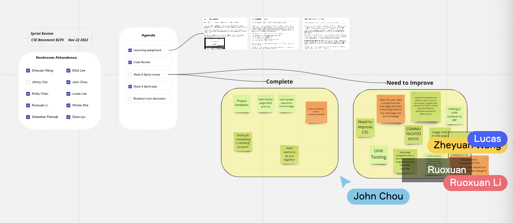

# Week 9 Sprint 2 Review Meeting Note

**Date: 11.22.2022**\
**Time: 5:30 pm - 6:30 pm**\
**Meeting Format: Hybrid (Zoom + CSE Basement)**

The goal of the meeting is to discuss the upcoming assignments, do code review, conduct week 8 sprint review meeting, and discuss week 9 sprint plan.

## Attendance

- [x] Zheyuan Wang
- [x] Ruoxuan Li
- [x] John Chou
- [x] Elliot Lee
- [x] Deze Lyu
- [ ] Jimmy Cho
- [x] Lucas Lee
- [x] Yunyi She
- [x] Kristy Chan
- [x] Sebastian Pamudji

## Discussed During Meeting

- Talked about upcoming assignment
- Reviewed all the existing code
- Conduct the second sprint review meeting
- Talked about week 9 sprint plan
- Split members into 3 different breakout rooms, each discuss their development corresponding page

## Completed Tasks

- Project fundation is set
- Have a static home page HTML and CSS
- Feature to load sample data from local storage
- Have a runnable and useable web application

## Need to Improve

- Need to improve CSS
- Consistency between the different teams, such as how styling is applied and structure of html: it clearly looks like different developers worked on different files
- When the user edits a recipe from the view page and save, it should go back to the view page, not the homepage
- Define the definition of 'Done'
- Have more unit testing
- Communication between different teams
- Improve buggy code in view page
- Styling issues such as font sizes (when to use relative vs absolute sizing)
- Making JS code conform to SRP

## Define the Definition of Done

- Pass CI pipline
- Write with comments
- The source files' names should be consistent
- The user can use it smoothly without encountering any bugs or major design issues
- The app should loop as pretty and consistent (between pages) as possible
- Code approved by a thorough PR
- Checked for sufficient abstraction / following SRP
- Pass the UI tests
- Checks all the boxes/requirements set on sprint board and issues connected to that task
- Complies with style guidelines

## Decisions Made During the Meeting

- Decide a time to meet again this Friday at 11 am
