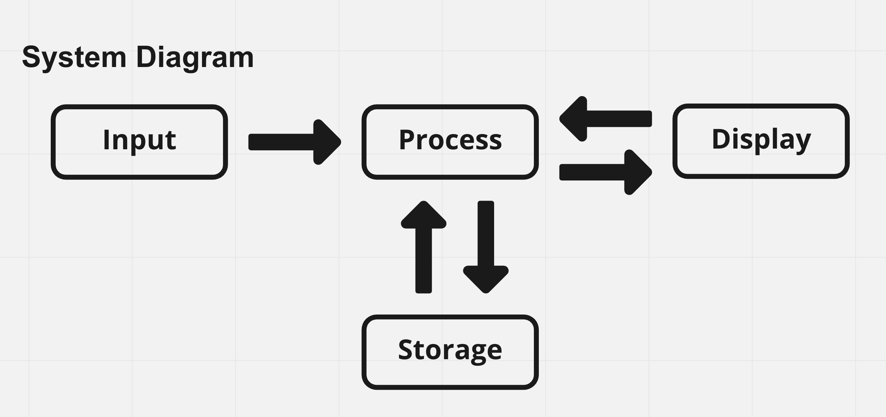
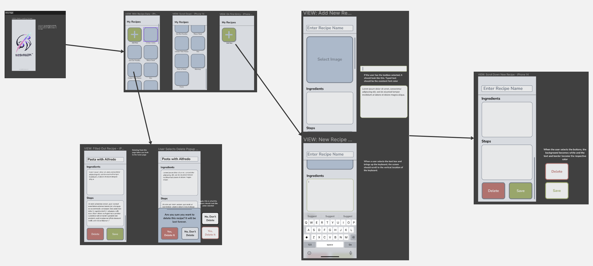

# Noshroom Pitch

## What problem are we trying to solve
- People who love cooking like to record their dairy recipe, and they need a tool for that

## Statement of purpose
Create a flexible personal dairy recipe record for people who enjoy cooking and wish to create and manage their own receipes
- We want to build a local first mobile App as a management system to help users record their dairy recipe
- We want to allow the users to navigate easily through different sections/tabs of the App
- We want to make the user experience as smooth as possible

## User personas
### Persona 1 - Thomas B Powell, 50
He is a chief at a French restaurant and he also enjoys cooking a lot at home. He always aim to improve his receipes so quite often he makes experiments about the ingredients use or make modification to the steps. He doesn't really enjoy using technologies that are too complicated. He just prefer simple things that cut to the point.

__Wants & Needs__
- Modify the receipes that he previously created
- Manage his list of receipes

__Frustration__
- Don't want to interact with complicated apps, would like to keep everything simple
- Don't want to experience difficulty/trouble while changing ingredients or steps in his receipe

### Persona 2 - Alice Brooks, 27
She is a mother of three children. She thinks food outside does not contain the necessary nutritions for the kids so she cooks for her kids all the time. Kids could be picky about food and she finds it is hard to memorize all the details for each recipe.

__Wants & Needs__
- Record all the receipes that she has previously used
- Choose from different receipe options

__Frustration__
- Don't want to spend much energy in finding her receipes among many others'
- Keep forgoting the details about her previous recipe

## System Diagram

## Visual representation (Wireframe) 

## Risks
- Try to maximize the number of features of the app within a very limited amount of time
- Some features require us to have advanced knowledge in certain tools, and learning a new tool takes time
- We unit-testing process of the project could be involved
- Ignore people's factors, e.g. people's ability to contribute as expected

## Rabbit holes
- We never wrapped a web app to a phone app before
- Make all the pictures fit the same rounded rectangle is hard
- Allow user to upload image and store it into database is new to us
- Store data in local storage and fetch it later could be hard to do
- We cut the custom tag function since that is beyoned out ability and cost too much time

