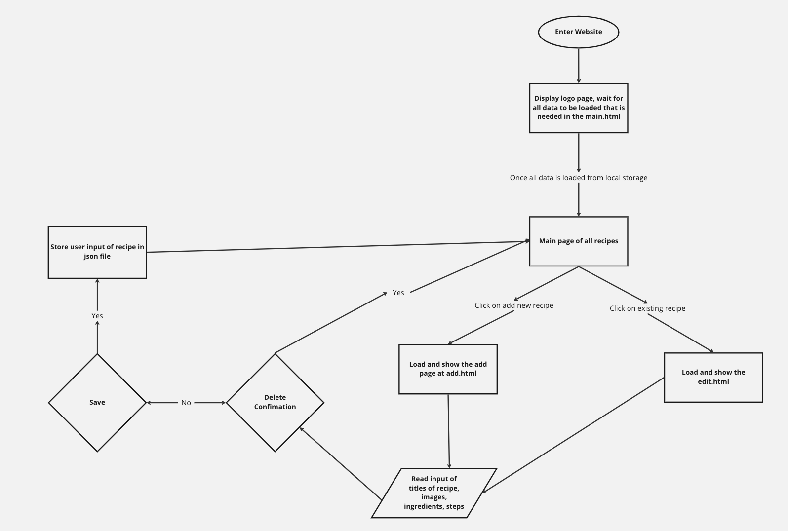
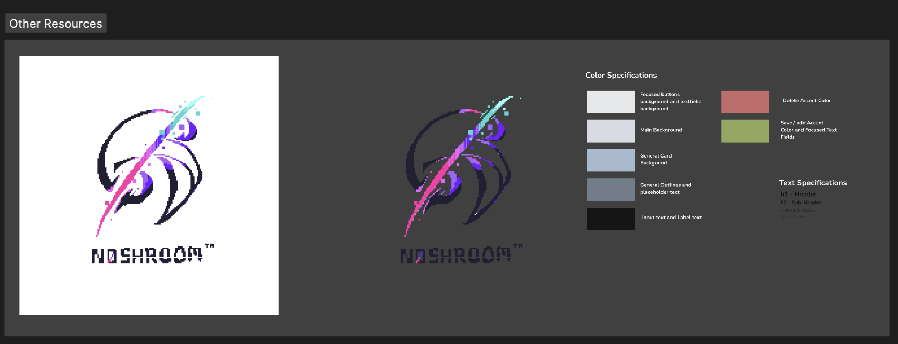
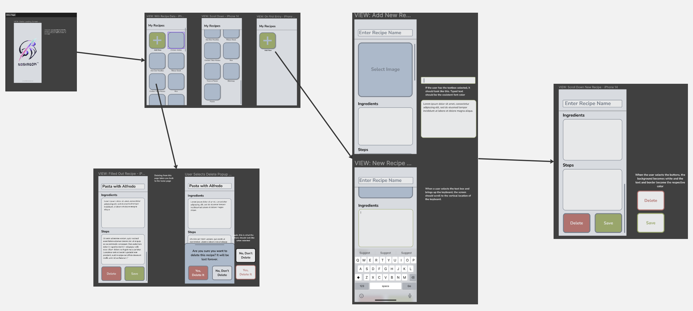

# Noshroom Pitch

## What problem are we trying to solve
- People who love cooking like to record their dairy recipe, and they need a tool for that

## Statement of purpose
- Create a local first CRUD app as a management system to help users record their dairy recipes

## User personas
### Persona 1 - Thomas B Powell, 50
Thomas is a chef at a French restaurant and he also enjoys cooking a lot at home. He always aims to improve his recipes so quite often he makes experiments with the ingredients use or makes modifications to the steps. He doesn't really enjoy using technologies that are too complicated. He prefers simple things that cut to the point.

__Wants & Needs__
- Modify the recipes that he previously created
- Manage his list of recipes

__Frustration__
- Don't want to interact with complicated apps, would like to keep everything simple
- Don't want to experience difficulty/trouble while changing ingredients or steps in his recipe

### Persona 2 - Alice Brooks, 27
Alice is a mother of three children. She thinks food outside does not contain the necessary nutritions for the kids so she cooks for her kids all the time. Kids could be picky about food and she finds it is hard to memorize all the details for each recipe.

__Wants & Needs__
- Record all the recipes that she has previously used
- Choose from different recipe options

__Frustration__
- Don't want to spend much energy in finding her recipes among many others'
- Keep forgetting the details about her previous recipes

## System Diagram

## Visual representation (Wireframe) 

## Risks
- The unit-testing process could spend more time than we expected
- We want to add one custom tag which will tremendously increasing the user experience, but we do not know how long can we build it
- People's factors, e.g. teammates' ability to contribute

## Rabbit holes
- We never wrapped a web app to a phone app before
- Make all the pictures fit the same rounded rectangle is no easy
- Allow user to upload image and store it into database is new to us
- Store data in local storage and fetch it could be hard

